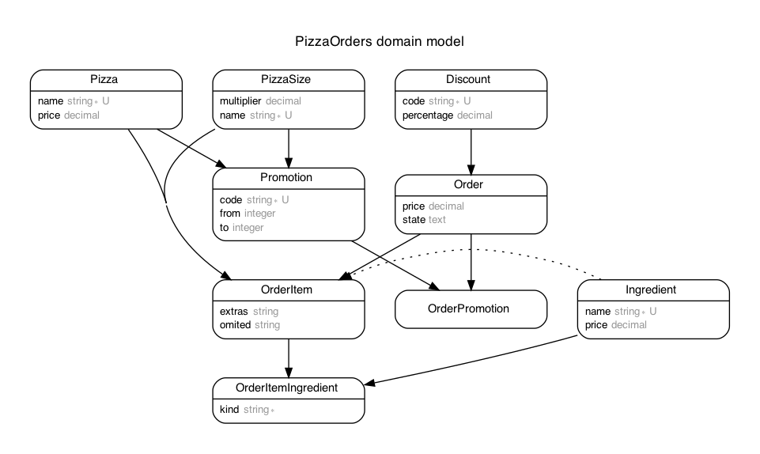

# README

## App Requirements

- Ruby >= 3.1
- PostgreSQL

or

- Docker + Compose

## Usage

Docker
```
docker-compose build
docker-compose up
```
The docker setup is so configured that the PostgreSQL doesn't save any data when shut down.
This can be changed by removing the comments around `volumes:` in `docker-compose.yml`.

```
install rails env
bundle install
Adapt db settings in config/database.yml
rails db:setup

rails s
```

Then just call localhost:3000 as usual and start using the app.
If you used the seed script, you can immediately start adding orders with the provided data from config file.
Furthermore, if you like to add data, you can use the links provided in the navbar to do so.

## Test Execution:

System tests require `Chrome`. Tests aren't supported within Docker environment.

```
install rails env
bundle install
Adapt db settings in config/database.yml
rails db:setup

rails test
rails test:system
```

The test coverage can be found at `/coverage/index.html` afte test execution.

## Static Code Analyzer

```
brakeman
rubocop
rubycritic
reek
rails_best_practices
```

I haven't fixed all warnings or silenced them.
It's arguable to which extend you must follow such gems.
Even though such gems are a great indicator for problems, common sense must be applied for its usefulness instead of rigid following.
Anyway, such rules need to be agreed on within the team.

## Differences to UI Wireframe

I allowed myself to improve the wireframe.
I cleaned up the design and left out information that is not important for the user like the ID.
Even more, discount codes and promotions are only displayed if they are used so that the user doesn't need to scan the full text.
I am happy to discuss my reasonings.

## Domain Model



generated with [rails-erd](https://github.com/voormedia/rails-erd)
